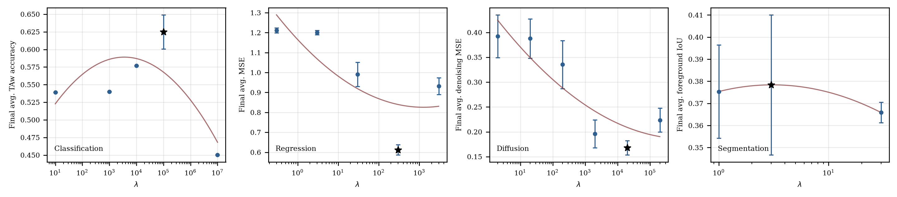
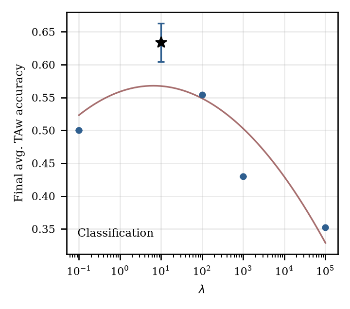
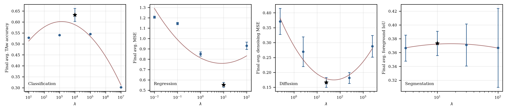
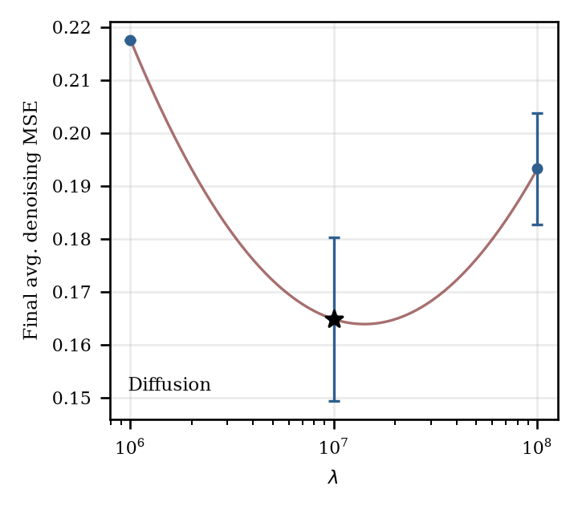

# Joint-Performance Lambda Validation

This artifact evaluates lambda selection with a joint final-performance objective. Classification uses the existing three-distribution CIFAR-100 FACIL prefix; regression uses a new five-distribution phase/amplitude stream; diffusion uses the accepted two-distribution DDPM denoising setup; segmentation uses the accepted two-step VOC animal/vehicle class-set setup.

For accuracy and IoU, larger joint values are better. For regression and diffusion MSE, smaller joint values are better. If the best value is on a grid edge, the intended follow-up rule is to extend the grid in that direction up to three times, stopping once the optimum is bracketed.

## Selected Lambda By Joint Objective

| Task           | Method     | Lambda | Joint metric      | Old final         | New final             | Forgetting        | n | Edge? |
| -------------- | ---------- | ------ | ----------------- | ----------------- | --------------------- | ----------------- | - | ----- |
| Classification | Sequential | seq.   | 0.5332 +/- 0.0171 | 0.3655 +/- 0.0265 | 0.8686 +/- 0.0123     | --                | 5 | no    |
| Classification | EF-EWC     | 1e+05  | 0.6250 +/- 0.0241 | 0.6030 +/- 0.0259 | 0.6690 +/- 0.0234     | 0.1060 +/- 0.0153 | 5 | no    |
| Classification | EWC-DR     | 10     | 0.6339 +/- 0.0291 | 0.5943 +/- 0.0344 | 0.7132 +/- 0.0238     | 0.1116 +/- 0.0350 | 5 | no    |
| Classification | IEWC       | 1e+04  | 0.6328 +/- 0.0295 | 0.6026 +/- 0.0300 | 0.6932 +/- 0.0304     | 0.1152 +/- 0.0411 | 5 | no    |
| Regression     | Sequential | seq.   | 1.2186 +/- 0.0145 | 1.5232 +/- 0.0181 | 3.33e-04 +/- 3.76e-04 | 1.5228 +/- 0.0181 | 5 | no    |
| Regression     | EF-EWC     | 300    | 0.6125 +/- 0.0254 | 0.4357 +/- 0.0075 | 1.3197 +/- 0.1312     | 0.2632 +/- 0.0648 | 5 | no    |
| Regression     | IEWC       | 10     | 0.5522 +/- 0.0233 | 0.4853 +/- 0.0200 | 0.8196 +/- 0.0710     | 0.2414 +/- 0.0342 | 5 | no    |
| Diffusion      | Sequential | seq.   | 0.3935 +/- 0.0435 | 0.6709 +/- 0.0865 | 0.1161 +/- 0.0153     | 0.5438 +/- 0.0916 | 5 | no    |
| Diffusion      | EF-EWC     | 2e+04  | 0.1680 +/- 0.0144 | 0.1508 +/- 0.0175 | 0.1853 +/- 0.0210     | 0.0236 +/- 0.0222 | 5 | no    |
| Diffusion      | IEWC       | 25     | 0.1665 +/- 0.0163 | 0.1764 +/- 0.0226 | 0.1566 +/- 0.0167     | 0.0490 +/- 0.0276 | 5 | no    |
| Diffusion      | IEWC-SW    | 1e+07  | 0.1648 +/- 0.0154 | 0.1626 +/- 0.0179 | 0.1670 +/- 0.0169     | 0.0296 +/- 0.0263 | 5 | no    |
| Segmentation   | Sequential | seq.   | 0.3708 +/- 0.0331 | 0.2623 +/- 0.0360 | 0.4792 +/- 0.0302     | 0.1633 +/- 0.0273 | 3 | no    |
| Segmentation   | EF-EWC     | 3      | 0.3784 +/- 0.0317 | 0.2808 +/- 0.0511 | 0.4760 +/- 0.0185     | 0.1481 +/- 0.0575 | 3 | no    |
| Segmentation   | IEWC       | 10     | 0.3735 +/- 0.0176 | 0.2882 +/- 0.0508 | 0.4587 +/- 0.0157     | 0.1371 +/- 0.0463 | 3 | no    |

## Lambda Curves

## Full Lambda Table

| Task           | Method     | Lambda | Joint metric      | Old final         | New final             | Forgetting         | n |
| -------------- | ---------- | ------ | ----------------- | ----------------- | --------------------- | ------------------ | - |
| Classification | Sequential | seq.   | 0.5332 +/- 0.0171 | 0.3655 +/- 0.0265 | 0.8686 +/- 0.0123     | --                 | 5 |
| Classification | EF-EWC     | 10     | 0.5393            | 0.3910            | 0.8360                | 0.4260             | 1 |
| Classification | EF-EWC     | 1000   | 0.5400            | 0.3910            | 0.8380                | 0.4200             | 1 |
| Classification | EF-EWC     | 1e+04  | 0.5770            | 0.4820            | 0.7670                | 0.3000             | 1 |
| Classification | EF-EWC     | 1e+05  | 0.6250 +/- 0.0241 | 0.6030 +/- 0.0259 | 0.6690 +/- 0.0234     | 0.1060 +/- 0.0153  | 5 |
| Classification | EF-EWC     | 1e+07  | 0.4503            | 0.5180            | 0.3150                | 0.0590             | 1 |
| Classification | EWC-DR     | 0.1    | 0.5003            | 0.3315            | 0.8380                | 0.4980             | 1 |
| Classification | EWC-DR     | 10     | 0.6339 +/- 0.0291 | 0.5943 +/- 0.0344 | 0.7132 +/- 0.0238     | 0.1116 +/- 0.0350  | 5 |
| Classification | EWC-DR     | 100    | 0.5543            | 0.5530            | 0.5570                | 0.0680             | 1 |
| Classification | EWC-DR     | 1000   | 0.4297            | 0.4395            | 0.4100                | 0.1990             | 1 |
| Classification | EWC-DR     | 1e+05  | 0.3523            | 0.4140            | 0.2290                | 0.0760             | 1 |
| Classification | IEWC       | 10     | 0.5280            | 0.3610            | 0.8620                | 0.4550             | 1 |
| Classification | IEWC       | 1000   | 0.5400            | 0.4360            | 0.7480                | 0.3870             | 1 |
| Classification | IEWC       | 1e+04  | 0.6328 +/- 0.0295 | 0.6026 +/- 0.0300 | 0.6932 +/- 0.0304     | 0.1152 +/- 0.0411  | 5 |
| Classification | IEWC       | 1e+05  | 0.5453            | 0.5540            | 0.5280                | 0.0800             | 1 |
| Classification | IEWC       | 1e+07  | 0.3023            | 0.3575            | 0.1920                | 0.2360             | 1 |
| Regression     | Sequential | seq.   | 1.2186 +/- 0.0145 | 1.5232 +/- 0.0181 | 3.33e-04 +/- 3.76e-04 | 1.5228 +/- 0.0181  | 5 |
| Regression     | EF-EWC     | 0.3    | 1.2118 +/- 0.0128 | 1.5147 +/- 0.0159 | 2.54e-04 +/- 2.03e-04 | 1.5143 +/- 0.0161  | 5 |
| Regression     | EF-EWC     | 3      | 1.2003 +/- 0.0111 | 1.4998 +/- 0.0139 | 0.0023 +/- 0.0013     | 1.4990 +/- 0.0140  | 5 |
| Regression     | EF-EWC     | 30     | 0.9906 +/- 0.0610 | 1.2196 +/- 0.0842 | 0.0747 +/- 0.0332     | 1.2145 +/- 0.0863  | 5 |
| Regression     | EF-EWC     | 300    | 0.6125 +/- 0.0254 | 0.4357 +/- 0.0075 | 1.3197 +/- 0.1312     | 0.2632 +/- 0.0648  | 5 |
| Regression     | EF-EWC     | 3000   | 0.9323 +/- 0.0418 | 0.6384 +/- 0.0475 | 2.1075 +/- 0.0838     | 0.0694 +/- 0.0169  | 5 |
| Regression     | IEWC       | 0.01   | 1.2073 +/- 0.0100 | 1.5087 +/- 0.0125 | 0.0014 +/- 3.88e-04   | 1.5082 +/- 0.0125  | 5 |
| Regression     | IEWC       | 0.1    | 1.1459 +/- 0.0107 | 1.4298 +/- 0.0134 | 0.0102 +/- 0.0017     | 1.4279 +/- 0.0137  | 5 |
| Regression     | IEWC       | 1      | 0.8514 +/- 0.0201 | 1.0364 +/- 0.0297 | 0.1112 +/- 0.0236     | 1.0172 +/- 0.0316  | 5 |
| Regression     | IEWC       | 10     | 0.5522 +/- 0.0233 | 0.4853 +/- 0.0200 | 0.8196 +/- 0.0710     | 0.2414 +/- 0.0342  | 5 |
| Regression     | IEWC       | 100    | 0.9304 +/- 0.0362 | 0.7453 +/- 0.0440 | 1.6707 +/- 0.0340     | 0.0225 +/- 0.0053  | 5 |
| Diffusion      | Sequential | seq.   | 0.3935 +/- 0.0435 | 0.6709 +/- 0.0865 | 0.1161 +/- 0.0153     | 0.5438 +/- 0.0916  | 5 |
| Diffusion      | EF-EWC     | 2      | 0.3924 +/- 0.0431 | 0.6685 +/- 0.0853 | 0.1163 +/- 0.0154     | 0.5414 +/- 0.0908  | 5 |
| Diffusion      | EF-EWC     | 20     | 0.3877 +/- 0.0398 | 0.6573 +/- 0.0745 | 0.1181 +/- 0.0155     | 0.5300 +/- 0.0828  | 5 |
| Diffusion      | EF-EWC     | 200    | 0.3353 +/- 0.0485 | 0.5459 +/- 0.0874 | 0.1247 +/- 0.0139     | 0.4187 +/- 0.0938  | 5 |
| Diffusion      | EF-EWC     | 2000   | 0.1961 +/- 0.0282 | 0.2484 +/- 0.0482 | 0.1438 +/- 0.0150     | 0.1212 +/- 0.0525  | 5 |
| Diffusion      | EF-EWC     | 2e+04  | 0.1680 +/- 0.0144 | 0.1508 +/- 0.0175 | 0.1853 +/- 0.0210     | 0.0236 +/- 0.0222  | 5 |
| Diffusion      | EF-EWC     | 2e+05  | 0.2237 +/- 0.0240 | 0.1363 +/- 0.0152 | 0.3110 +/- 0.0379     | 0.0091 +/- 0.0257  | 5 |
| Diffusion      | IEWC       | 0.25   | 0.3713 +/- 0.0438 | 0.6232 +/- 0.0789 | 0.1194 +/- 0.0142     | 0.4959 +/- 0.0880  | 5 |
| Diffusion      | IEWC       | 2.5    | 0.2696 +/- 0.0500 | 0.4067 +/- 0.0903 | 0.1325 +/- 0.0143     | 0.2795 +/- 0.0956  | 5 |
| Diffusion      | IEWC       | 25     | 0.1665 +/- 0.0163 | 0.1764 +/- 0.0226 | 0.1566 +/- 0.0167     | 0.0490 +/- 0.0276  | 5 |
| Diffusion      | IEWC       | 250    | 0.1816 +/- 0.0186 | 0.1418 +/- 0.0171 | 0.2214 +/- 0.0252     | 0.0146 +/- 0.0254  | 5 |
| Diffusion      | IEWC       | 2500   | 0.2876 +/- 0.0362 | 0.1334 +/- 0.0142 | 0.4419 +/- 0.0645     | 0.0063 +/- 0.0248  | 5 |
| Diffusion      | IEWC-SW    | 1e+06  | 0.2176            | 0.2987            | 0.1365                | 0.1508             | 1 |
| Diffusion      | IEWC-SW    | 1e+07  | 0.1648 +/- 0.0154 | 0.1626 +/- 0.0179 | 0.1670 +/- 0.0169     | 0.0296 +/- 0.0263  | 5 |
| Diffusion      | IEWC-SW    | 1e+08  | 0.1932 +/- 0.0105 | 0.1307 +/- 0.0171 | 0.2558 +/- 0.0177     | -0.0023 +/- 0.0184 | 5 |
| Segmentation   | Sequential | seq.   | 0.3708 +/- 0.0331 | 0.2623 +/- 0.0360 | 0.4792 +/- 0.0302     | 0.1633 +/- 0.0273  | 3 |
| Segmentation   | EF-EWC     | 1      | 0.3754 +/- 0.0211 | 0.2798 +/- 0.0531 | 0.4709 +/- 0.0158     | 0.1517 +/- 0.0480  | 3 |
| Segmentation   | EF-EWC     | 3      | 0.3784 +/- 0.0317 | 0.2808 +/- 0.0511 | 0.4760 +/- 0.0185     | 0.1481 +/- 0.0575  | 3 |
| Segmentation   | EF-EWC     | 30     | 0.3659 +/- 0.0046 | 0.2621 +/- 0.0220 | 0.4697 +/- 0.0237     | 0.1691 +/- 0.0155  | 3 |
| Segmentation   | IEWC       | 3      | 0.3666 +/- 0.0188 | 0.2760 +/- 0.0291 | 0.4571 +/- 0.0187     | 0.1550 +/- 0.0362  | 3 |
| Segmentation   | IEWC       | 10     | 0.3735 +/- 0.0176 | 0.2882 +/- 0.0508 | 0.4587 +/- 0.0157     | 0.1371 +/- 0.0463  | 3 |
| Segmentation   | IEWC       | 30     | 0.3711 +/- 0.0304 | 0.2978 +/- 0.0598 | 0.4444 +/- 0.0114     | 0.1348 +/- 0.0365  | 3 |
| Segmentation   | IEWC       | 100    | 0.3669 +/- 0.0571 | 0.3099 +/- 0.1065 | 0.4240 +/- 0.0178     | 0.1276 +/- 0.0962  | 3 |
